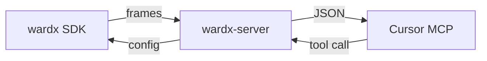

# Wardx architecture

One process, two doors. Both go both ways. There is no admin HTTP API.

```text
                         AGENT
                  arisa.sh / Codex / Claude
                             │
                    MCP stdio
                    tools + wardx://project/{name}
                             ▼
┌───────────────────────────────────────────────────┐
│              wardx-server (one process)           │
│              N isolated projects                  │
│                                                   │
│   MCP ──► ControlService                          │
│              ├── Remote Config snapshot            │
│              ├── Experiment definitions            │
│              ├── Aggregates                       │
│              ├── Recent logs                      │
│              └── Catalog                          │
│                                                   │
│   HTTP POST /v1/sync                              │
│        ├── envelope store (config.sink)            │
│        │     null | memory | ndjson               │
│        └── per-project ingest                     │
│              aggregator, recent logs, clients     │
│              config reply filtered by client.role   │
└─────────────────────────▲─────────────────────────┘
                          │
             frames up / that role's config down
          ┌───────────────┴───────────────┐
          ▼                               ▼
   Node SDK                          C# / Unity SDK
   wardx / @wardx/core               clients/csharp
   role: game-server                 role: mobile
   metrics / config.get               same /v1/sync
```

`@wardx/core` lives in the SDK, not in the server. The server stores the snapshot, aggregates 1-minute windows, and serves MCP. Experiment assignment and `config.get` run on the client. `identify()` sets the instance subject; a per-call `subjectId` overrides it.

MCP lists projects with `list_projects`. Every other tool takes a `project` name. Projects are declared in the server config (`projectKeys` + `projects`); MCP does not create them.

A project is one product. Each SDK instance declares a `role`, an open name (`unity`, `game-server`, `desktop`, `mobile`, …). Several roles share the project. They may measure similar names; series stay separate by role. Remote Config keys list the roles that receive them, or `["*"]` for every role. Experiments list the roles that assign them. A sync downloads only what that role can see.

The SDK ships names only. Meaning lives in the MCP catalog, which never goes down HTTP. Two ways to fill it, both valid: ship a predefined `catalog` in the server config, or leave descriptions empty and complete them during MCP onboarding (`set_project_description` / `set_role_description` / `set_signal`). `get_project_overview.onboarding` lists only the remaining gaps, including undescribed roles. If `onboarding.complete` is true, the agent skips questions. If a new undescribed name or role appears later, onboarding reopens for that gap only. Each role may optionally carry `path` (checkout on this machine) and `git` (repository URL). The agent uses them when present. It does not ask for them.

The envelope store is process-wide. It is not part of ControlService. MCP does not read it. Production uses `sink: "null"` (`config/production.json`): discard envelopes after ingest. `memory` and `ndjson` are for local debugging and benchmarks. MCP reads 1-minute aggregates and the recent-log ring, not the envelope store.

## Instrumentation

Use the cheapest signal that still answers the question.

- **Stability:** counters and histograms (`http.requests`, `http.duration`, queue depth). `log.error` when a request fails, with a clipped `stack` or provider `code` as an attr. Not an event per request. MCP `get_recent_logs` returns that row. If the role has `path` or `git`, the agent uses that checkout to edit the source. Wardx does not change application code. See `wardx` use case 16 and `@wardx/server` use case 8.
- **Session time:** the app owns the play-session clock (open to close, login to logout). Do not use SDK `sessionId`. On end: histogram `session.duration` with minute-scale buckets, counter `session.time_ms` (accumulated fleet ms), counter `session.ended`, and one `experiment.goal('session.duration', { value: durationMs })`. Optional heartbeat adds only to `session.time_ms`. `analyze_experiment` compares `goalMean` by variant and returns a `decision`. Close a winner with `ship_experiment`. See `wardx` use case 14.
- **Behavior:** a few named events (`screen.view`, `feature.use`, `match.start`) with low-cardinality attrs (`mode`, `channel`, `feature`). A shared name is one outcome. Attrs do not split it.
- **Funnels:** volume between named steps, not a unique-user path. One event name and one counter per step (`onboarding.start` → `onboarding.profile` → `onboarding.done`, or `level.start` → `level.fail` / `level.complete`). Compare those counts in `get_aggregates`. The aggregator counts events by name and role; event attrs do not split the funnel. `sessionId` is envelope identity, not a join key. Production discards envelopes (`sink: "null"`). There is no per-subject sequence, no uniques, and no time between steps. `experiment.goal` is a one-step conversion or one quantitative value, not an N-step funnel. One experiment should have one quantitative goal name. See `wardx` use cases 7 and 15.
- **Business:** rare events: `purchase`, `experiment.exposure`, `experiment.goal`.
- **Economy:** counters of amount and grant count by `source`, plus a histogram of award size. Pass grant attrs to `observe(value, attrs)` so the window max carries an exemplar (a lookup key, not a series per player). A rare `coins.anomaly` event when a grant exceeds a Remote Config cap. MCP overview ranks histogram outcomes by `max` so an agent can compare that peak to the cap, then `get_recent_logs` with the exemplar attrs and open the role `path`/`git`. Per-player consistency is the game database. Wardx is at-most-once and not a ledger. See `wardx` use case 8 and `@wardx/server` use case 9.
- **Dimensions:** `route`, `result`, `mode`, `source`. Never `userId`, email, or a unique id on a metric. The SDK caps series per process; the server also caps series per metric name per minute (`aggregateMaxSeriesPerMetric`).
- **Backend SDK:** if one process serves many users, increment counters in process. Do not `event()` once per user action. Give that process its own role so MCP does not mix it with a player client.



**SDK ↔ HTTP.** `POST /v1/sync`: the client sends frames, `configVersion`, and `client.role`. The server always replies `ok` and `configVersion`, and includes that role's `config` when the version changed. Telemetry goes up. Remote Config comes down. Same round-trip.

**MCP ↔ agent.** stdio JSON-RPC: the agent calls tools and can read `wardx://project/{name}`. The process returns JSON: project catalog (what the product is, what keys and metrics mean), telemetry, and previously proposed experiments. The same channel writes config and new experiments over those Remote Config keys. A new value reaches the SDK on the next sync. The catalog never goes down HTTP.

**They meet in memory.** HTTP writes frames and reads config. MCP reads aggregates and recent logs, and writes config. The same HTTP handler also writes the envelope store. The SDK does not speak MCP. The agent does not call `/v1/sync`.

## Example

1. `npm run example` flushes. Frames go up. The snapshot with `message.delayMs` comes down.
2. In Cursor, `set_config_value` to `400`. The tool returns `{ version: 2 }`.
3. The next SDK flush receives the new config. `get_aggregates` reads rates. `get_recent_logs` drills into a sample log row. If that role has `path` or `git`, the agent opens that checkout and edits outside MCP.
